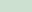

# Notes

This document contains additional notes relevant to StarCraft development.

## Poor color combinations

In 1v1 games, a number of color combinations result in poor visibility, especially on the minimap. When games are played in Top vs Bottom, the colors can be switched to red and blue (colors 0 and 1), but if the game is any other game mode the colors can only be switched to all yellow or all red.

The following color combinations are deemed to have poor visibility or contrast, and as such it's recommended that they be changed to red and blue by editing the color value in the replay file. This is a subjective list, and a fairly conservative one, so as application developer you might consider expanding this as desired.

<table>
<tbody>
<tr><th colspan="7" align="left">Poor color combinations</th></tr>
<tr><th colspan="3" align="left">Color A</th><th> </th><th colspan="3" align="left">Color B</th></tr>
<tr>
<td>White</td><td>6</td><td></td>
<td>vs</td>
<td></td><td>Pale yellow</td><td>9</td>
</tr>
<tr>
<td>White</td><td>6</td><td></td>
<td>vs</td>
<td></td><td>Tan</td><td>10</td>
</tr>
<tr>
<td>White</td><td>6</td><td></td>
<td>vs</td>
<td></td><td>Pink</td><td>16</td>
</tr>
<tr>
<tr>
<td>Tan</td><td>10</td><td></td>
<td>vs</td>
<td></td><td>Pink</td><td>16</td>
</tr>
<tr>
<td>Gray</td><td>22</td><td></td>
<td>vs</td>
<td></td><td>Black</td><td>23</td>
</tr>
<tr>
<td>Lime</td><td>18</td><td></td>
<td>vs</td>
<td></td><td>Olive</td><td>17</td>
</tr>
<tr>
<td>Teal</td><td>2</td><td></td>
<td>vs</td>
<td></td><td>Pale green</td><td>12</td>
</tr>
</tbody>
</table>
