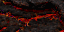
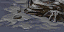
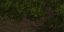
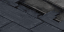

  

# @dada78641/bwtoolsdata

Collection of Brood War data and functions used to help interpret replay and map files.

## Usage

This library recently got rewritten and I haven't documented the new interface yet.

See src/lib/index.ts for the user facing functions you'll want to import.

### In-game colors

Colors work quite inconsistently in StarCraft. There are two sets of color codes: one for briefing messages (and map names), and one for in-game chat messages. These each have their quirks that are different between Brood War (v1.16.1 and below) and Remastered.

Here's a list of all colors:

<table>
<tbody>
<tr><th colspan="6" align="left">Briefing text colors</th></tr>
<tr><th colspan="2" align="left">Name</th><th colspan="2" align="left">Hex value</th><th align="left">Code</th><th align="left">Slug</th></tr>
<tr><td colspan="2">Pale blue</td><td></td><td>#a4b4f8</td><td>0x02</td><td>bt_pale_blue</td></tr>
<tr><td colspan="2">Green</td><td></td><td>#4cc428</td><td>0x03</td><td>bt_green</td></tr>
<tr><td colspan="2">Light green</td><td></td><td>#b4fc74</td><td>0x04</td><td>br_light_green</td></tr>
<tr><td colspan="2">Gray†</td><td></td><td>#585858</td><td>0x05</td><td>bt_gray</td></tr>
<tr><td colspan="2">White</td><td></td><td>#ffffff</td><td>0x06</td><td>bt_white</td></tr>
<tr><td colspan="2">Red</td><td></td><td>#fc0000</td><td>0x07</td><td>bt_red</td></tr>
</tbody>
<tbody>
<tr><th colspan="6" align="left">In-game text colors</th></tr>
<tr><th colspan="2" align="left">Name/slot ID‡</th><th colspan="2" align="left">Hex value</th><th align="left">Code</th><th align="left">Slug</th></tr>
<tr><td colspan="2">Pale blue</td><td></td><td>#b8b8e8</td><td>0x02</td><td>ig_pale_blue</td></tr>
<tr><td colspan="2">Yellow</td><td></td><td>#dcdc3c</td><td>0x03</td><td>ig_yellow</td></tr>
<tr><td colspan="2">White</td><td></td><td>#ffffff</td><td>0x04</td><td>ig_white</td></tr>
<tr><td colspan="2">Red</td><td></td><td>#c81818</td><td>0x06</td><td>ig_red</td></tr>
<tr><td colspan="2">Green</td><td></td><td>#10fc18</td><td>0x07</td><td>ig_green</td></tr>
<tr><td colspan="2">Gray†</td><td></td><td>#847474</td><td>0x05</td><td>ig_gray</td></tr>
<tr><td>Red</td><td>0</td><td></td><td>#f40404</td><td>0x08</td><td>red</td></tr>
<tr><td>Blue</td><td>1</td><td></td><td>#0c48cc</td><td>0x0e</td><td>blue</td></tr>
<tr><td>Teal</td><td>2</td><td></td><td>#2cb494</td><td>0x0f</td><td>teal</td></tr>
<tr><td>Purple</td><td>3</td><td></td><td>#88409c</td><td>0x10</td><td>purple</td></tr>
<tr><td>Orange</td><td>4</td><td></td><td>#f88c14</td><td>0x11</td><td>orange</td></tr>
<tr><td>Brown</td><td>5</td><td></td><td>#703014</td><td>0x15</td><td>brown</td></tr>
<tr><td>White</td><td>6</td><td></td><td>#cce0d0</td><td>0x16</td><td>white</td></tr>
<tr><td>Yellow</td><td>7</td><td></td><td>#fcfc38</td><td>0x17</td><td>yellow</td></tr>
<tr><td>Green</td><td>8</td><td></td><td>#088008</td><td>0x18</td><td>green</td></tr>
<tr><td>Pale yellow</td><td>9</td><td></td><td>#fcfc7c</td><td>0x19</td><td>yellow</td></tr>
<tr><td>Tan</td><td>10</td><td></td><td>#ecc4b0</td><td>0x1b</td><td>tan</td></tr>
<tr><td>Cerulean</td><td>11</td><td></td><td>#4068d4</td><td>0x1c</td><td>cerulean</td></tr>
<tr><td>Pale green</td><td>12</td><td></td><td>#74a47c</td><td>0x1d</td><td>pale_green</td></tr>
<tr><td>Bluish gray</td><td>13</td><td></td><td>#9090b8</td><td>0x1e</td><td>bluish_gray</td></tr>
<tr><td>Turquoise</td><td>15</td><td></td><td>#00e4fc</td><td>0x1f</td><td>turquoise</td></tr>
<tr><td>Pink</td><td>16</td><td></td><td>#ffc4e4</td><td>–</td><td>pink</td></tr>
<tr><td>Olive</td><td>17</td><td></td><td>#787800</td><td>–</td><td>olive</td></tr>
<tr><td>Lime</td><td>18</td><td></td><td>#d2f53c</td><td>–</td><td>lime</td></tr>
<tr><td>Navy</td><td>19</td><td></td><td>#0000e6</td><td>–</td><td>navy</td></tr>
<tr><td>Magenta</td><td>21</td><td></td><td>#f032e6</td><td>–</td><td>magenta</td></tr>
<tr><td>Gray</td><td>22</td><td></td><td>#808080</td><td>–</td><td>gray</td></tr>
<tr><td>Black</td><td>23</td><td></td><td>#3c3c3c</td><td>–</td><td>black</td></tr>
</tbody>
</table>

†: In StarCraft, gray is buggy: when it's used in a map name in Brood War, the rest of the name becomes gray as well—this was fixed in Remastered. In in-game text messages, gray will take over the entire rest of the line, both in Brood War and Remastered. This buggy behavior is not completely implemented in this library, and more research is needed to determine every edge case.

‡: Slot IDs 11, 14, 15 and 20 are not selectable as player colors (the color for 11 is used for the neutral player, however). 11 and 15 are still usable as text color. 14 and 20 are duplicates of Pale Yellow and Cerulean.

### Tilesets

The following are all available tileset types.

A few of the aforementioned player colors are not pickable on certain tilesets (due to bad contrast).

<table>
<tbody>
<tr>
<th colspan="2" align="left">Tileset name</th>
<th align="left">Internal name</th>
<th align="left">ID</th>
<th align="left">Disallowed colors</th>
</tr>

<tr>
<td>Ash World</td>
<td></td>
<td>ashworld</td>
<td>3</td>
<td>Gray, Black</td>
</tr>

<tr>
<td>Badlands</td>
<td></td>
<td>badlands</td>
<td>0</td>
<td>–</td>
</tr>

<tr>
<td>Desert</td>
<td></td>
<td>desert</td>
<td>5</td>
<td>Orange</td>
</tr>

<tr>
<td>Ice†</td>
<td></td>
<td>ice</td>
<td>6</td>
<td>White</td>
</tr>

<tr>
<td>Installation‡</td>
<td></td>
<td>install</td>
<td>2</td>
<td>Blue, Navy, Bluish gray</td>
</tr>

<tr>
<td>Jungle World</td>
<td></td>
<td>jungle</td>
<td>4</td>
<td>–</td>
</tr>

<tr>
<td>Space Platform</td>
<td></td>
<td>platform</td>
<td>1</td>
<td>Gray, Black</td>
</tr>

<tr>
<td>Twilight</td>
<td></td>
<td>twilight</td>
<td>7</td>
<td>Bluish gray</td>
</tr>

</tbody>
</table>

†: Also called "Arctic" in the community.

‡: The Installation tileset is only used in the campaign and does not support regular custom games.

The internal names are the names used by the game files themselves, whereas the proper names are taken from the original Brood War map editor.

### Game speed

Number of milliseconds per game frame for each game speed.

E.g. for "Fastest", there are approximately 1000 / 42 = ~23.81 frames in a second. This is used to convert the number of game frames into real time.

| Name    | ㎳/frame | Frames/second | % of "Fastest" |
|:--------|:--------|:---------------|:---------------|
| Fastest | 42  | 23.810 | 100.0% |
| Faster  | 48  | 20.833 | 87.5% |
| Fast    | 56  | 17.857 | 75.0% |
| Normal  | 67  | 14.925 | 62.7% |
| Slow    | 83  | 12.048 | 50.6% |
| Slower  | 111 | 9.009 | 37.8% |
| Slowest | 167 | 5.988 | 25.1% |

By far most replays use "Fastest" as the speed, but this table can be used for the rare cases that aren't. In the very old days of StarCraft, the ladder speed setting was "Fast" by default, but this got changed to "Fastest" relatively early on.

## License

MIT licensed.
